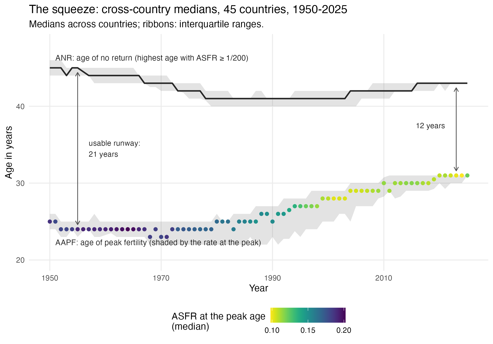

::: {.content-visible when-format="docx"}
> **FOR REVIEWERS (Word copy).** Please comment using Word's *Comments* and
> *Track Changes* features - do not edit silently. Return the file to
> <jon.will.minton@gmail.com>. Comments will be logged in the project's public
> feedback register (`manuscript_2026/review/FEEDBACK.md` on GitHub), actioned,
> and credited; substantive contributions meeting authorship criteria are
> recognized with co-authorship in later versions, with consent. This is the
> MERGED draft v0.2 (2026-07-19), not yet submitted anywhere.
:::

::: {.callout-note}
**Draft status and authorship.** This is a sole-authored working version
posted for open comment; Jon Minton is the only author and is solely
responsible for its content. It supersedes two working papers of 11 July
2026 and a first merged draft of 14 July 2026, all retained in the project
repository for provenance. The manuscript updates and builds on
@pattaro2020, whose co-authors Serena Pattaro and Laura Vanderbloemen are
acknowledged for the original work and for review comments on the working
papers, but are not authors of this version; contributions meeting
authorship criteria will be recognized with co-authorship in later
versions, with consent. The manuscript was drafted with AI assistance
(Claude, Anthropic) under the author's direction; the role of AI-assisted
workflow in this project is described in the Discussion. The analysis is
reproducible from <https://github.com/JonMinton/comparative_fertility>;
analytic choices (thresholds, definitions) were fixed in the repository's
public workplan before the analysis ran on the updated data, with
prototypes on the pre-update data disclosed there. Additional materials are
in the accompanying supplement (sections S1-S8), generated from the same
repository.
:::

# Introduction

Fertility decline is attracting attention again, and with a new inflection:
not just that fertility in high-income countries is low, but that its
decline appears to have steepened since the late 2000s and to be arriving
everywhere at once. The most widely read descriptive accounts are
period-TFR-based: a recent Our World in Data (OWiD) insight documents
fertility rates converging steeply downward across countries with very
different starting points [@ritchie2026convergence], and data journalism in
the *Financial Times* has argued that the timing of the steepening tracks
mass smartphone adoption across otherwise dissimilar countries
[@burnmurdoch2026phones]. A research literature on the acceleration and its
candidate causes - economic precarity after 2008, digital-technology
exposure, housing and partnership - is growing quickly [@sobotka2011;
@kearney2022; @hudson2026teen; @moscoso2026wide; @myers2026iphone].

This paper approaches the renewed interest from the descriptive side, in
three phases. First, we reintroduce a visualization method - composite
fertility lattice plots for 45 countries, published in 2020 - and consider
candidly why its uptake was limited. Second, we show that the method's 2020
outputs contained falsifiable forecasts for Norway and the United States;
we update the panel to 2023-25 and check them, finding both qualitatively
correct but quantitatively optimistic. Third, we formalize two quantities
that the surfaces make visible - the age and amount of peak fertility
(AAPF) and the age of no return (ANR) - and show that their convergent
trajectories, peak later and lower, endpoint sooner, are the age-structure
mechanics beneath the TFR convergence now drawing attention: cohorts are
running out of runway.

# The visualization method, and why it deserves a second look

## Composite fertility lattice plots

Using Human Fertility Database (HFD) and Human Fertility Collection (HFC)
data ending in 2014-15, @pattaro2020 introduced composite fertility lattice
plots: Lexis surfaces combining level-plot shading of age-specific
fertility rates (ASFRs) with contour lines marking cumulative pseudo-cohort
fertility rate (CPCFR) milestones of 1.50 and 2.05 ("replacement") children
per woman, drawn for 45 countries on a common specification [@sarkar2008].
The underlying object is a surface in the literal sense: fertility as a
terrain over age and time, whose height at any point is the ASFR
(@fig-terrain). The lattice plots are the bird's-eye view of this terrain,
with height carried by shading; the crest line of the terrain - the age at
which each year's schedule peaks, and the rate at that peak - is a feature
we will return to and name in Section 3.

![The fertility surface as terrain: Norway, 1950-2024. The height of the surface at each year and age is the ASFR; shading matches the lattice plots used throughout (darker is higher). The magenta crest line is the AAPF ridge - the age and amount of peak fertility - formalized in Section 3. The composite lattice plots read this terrain from above. (Norway is used as the example because its schedules have a clean single peak; see Supplement S8 for the United States' historically flat-topped profile.)](figures/lexis3d_ridge_norway.png){#fig-terrain}

Reading the flattened surface requires one distinction above all: between
age, period, and cohort effects. Age effects are lifecycle regularities -
fertility concentrated in the twenties and early thirties, the terrain's
main massif. Period effects strike all ages in the same calendar years: a
crisis, a pandemic, a price shock. Cohort effects travel with generations,
set early and carried forward as each cohort ages. On the surfaces used in
this paper, age runs up the vertical axis and birth cohorts along the
horizontal, so period effects appear as diagonal bands [@pattaro2020;
@burkimsher2017]. The three are easy to conflate and expensive to confuse,
and the United States supplies the cautionary example this paper returns
to: its period TFR fell from 2.12 to 1.59 after 2007, so on period evidence
alone the American fertility exception died in the financial crisis - yet
cohort-cumulative milestones show women born as late as 1984 completing
replacement-level childbearing in the 2020s. Period accounting misdates the
end of the US exception by nearly two decades, because postponed births are
debited to the years in which they did not occur rather than credited to
the cohorts that eventually had them [@sobotka2017].

## Why uptake was limited

The method's uptake since 2020 has been modest, and it is worth being
candid about the likely reasons, because they set this paper's agenda. The
first is inherent complexity. The composite form already carries four
encodings - two positional axes, shading, and contour weight - which
approaches the limit of comfortable readability for many audiences; the
plots repay study but do not yield their content at a glance. The second
reason is, we suspect, a methodologist's suspicion: that visualizations,
however rich, do not generate the clear predictions and projections that
formal statistical models do - that reading graphs is commentary, not
inference. The first concern we address by distillation: Section 6 reduces
each surface to two trajectories that fit on a single ordinary chart. The
second concern is answerable empirically, because the 2020 paper did
something unusual for a descriptive visualization piece: it made
predictions, in print, and enough time has now passed to check them.

# Data and methods

## The 2026 rebuild

We reapply the combination rules of @pattaro2020 to the current HFD
[@hfd2026] and HFC [@hfc2026] releases: HFD is preferred over HFC for any
country-year; within the HFC, single-year periods with age in completed
years are retained under the collection preference STAT > ODE > RE; small
internal gaps (at most four years) are linearly interpolated and flagged.
The updated panel spans 1850-2025 (51 populations before the published
exclusions; the same 45-country panel after them). One correction to the
2016 build is applied: HFD's France series (code FRATNP) was previously
dropped by an unmapped country code, so the published figures showed France
ending in 2008; the updated build restores France to 2023. A back-revision
audit against the 2016 dataset is included in the repository; the largest
differences (Ireland, Spain, Denmark) reflect HFD's own revisions of
historical exposures.

Two reproducibility properties matter for what follows. First, the 2020
findings are reproducible from the dataset frozen in the repository - the
exact data behind the published figures are preserved at the public
repository tag `demres-2020` - but they are not exactly replicable from
fresh source downloads, because the source databases have themselves been
revised; an inherent property of living data infrastructures, and part of
the motivation for periodic updates of this kind. Second, it was this
preserved, re-runnable codebase that made the present update tractable at
all: the update is as much a test of the pipeline's reproducibility as of
the paper's claims. Where this paper compares "then" with "now" (Section
4), the "then" panels are re-rendered from the tagged 2020-vintage data in
the current visual specification, so that the only difference between the
compared panels is the data window.

All surface figures use the published visual specification: viridis
(reversed) level-plot shading of ASFR on birth-year by age panels, solid
contours at CPCFR = 2.05 and 1.50, years 1950 onward, ages to 50, and
countries ordered by CPCFR at 2007, the ranking year of the published
figures [@sarkar2008; @garnier2018].

## Formal definitions: AAPF and ANR

If visual reading is to answer the methodologist's suspicion of Section
2.2, its objects should be defined, not just pointed at. Let $f_{c}(x, t)$
denote the ASFR of population $c$ at single year of age $x$ in calendar
year $t$, and let the cumulative pseudo-cohort fertility rate of the cohort
born in year $b = t - x$ be the sum of the ASFRs the cohort has traversed:

$$F_{c}(x, b) = \sum_{u < x} f_{c}(u,\; b + u),$$

with replacement read as $F \geq 2.05$ [@pattaro2020]. Three per-year
summaries are then defined, with all operational choices fixed ex ante in
the repository's public workplan before the analysis ran on the updated
data:

- **Age and amount of peak fertility (AAPF).** The ridge of the surface in
  @fig-terrain: the modal age of the schedule and the rate at that age,
  $$x^{*}_{c}(t) = \arg\max_{x} f_{c}(x, t), \qquad
    f^{*}_{c}(t) = f_{c}\!\left(x^{*}_{c}(t),\, t\right),$$
  with ties broken to the youngest tied age, so flat or plateau schedules
  are read conservatively (the United States' historical plateau makes this
  choice consequential; Supplement S8).
- **Age of no return (ANR).** The effective upper end of the fertility
  lifecourse: the highest age at which childbearing remains a live
  behavioural possibility rather than a rarity,
  $$A_{c}(t) = \max\{\, x : f_{c}(x, t) \geq \varphi \,\}, \qquad
    \varphi = 1/200,$$
  with $\varphi = 1/1000$ as a sensitivity threshold (Supplement S4). Three
  considerations justify the operationalisation. The threshold is
  *absolute* rather than relative (for example, a quantile of the schedule)
  because the benchmark it serves - replacement - is absolute; a relative
  threshold would move with the schedule and hide precisely the narrowing
  we wish to measure. The primary value 1/200 is interpretable - fewer
  than one birth per two hundred woman-years - and empirically it marks
  the age above which remaining cumulative fertility is small in
  replacement terms: cumulative ASFR above age 40 has ranged between 0.02
  and 0.12 children across the post-war panel (Section 6), at most a few
  percent of a 2.05 target. And the trend is robust to the choice: the
  1/1000 ceiling sits roughly two years higher but moves in parallel.
- **Reachability.** For each cohort observed from age 16 or earlier, the
  age at which $F$ first reaches 2.05, classified as *crossed*; *never*
  (observed beyond age 44 without crossing); or *censored* (still
  unobserved at the ages that would decide it).

The vertical distance $A_{c}(t) - x^{*}_{c}(t)$ between the two ages is
the *usable runway*: the span between where childbearing is concentrated
and where it effectively ends. Per-country trajectories are the primary
outputs throughout; pooled cross-country medians are reported as context.

# The 2020 forecasts, checked

## What the 2020 paper predicted

The 2020 paper reported a striking regularity across its 45 countries:
once a country's cohorts fell below the replacement milestone, they tended
not to return to it. Two exceptions were named - Norway, where cohorts born
after the 1950s regained replacement, and the United States, for cohorts
born after the late 1960s - and for these two the paper went beyond
description. Reading the trajectories of the replacement contours in its
Figure 2, the published discussion reasoned that the contour "has been
trending upwards for Norway but falling for the United States," that
cumulative fertility by age 43 is in practice close to completed fertility,
and concluded that "Norway looks likely to lose replacement fertility
levels over the next few years," whereas "we might assume that replacement
levels will be sustained for longer in the United States" [@pattaro2020,
pp. 699-700]. In a pre-publication working version of the figure the
forecasts were drawn rather than stated, as dotted lines labelled
"speculative extrapolation of replacement contour": climbing steeply for
Norway, continuing near-flat at age 37 for the United States. The drawn
lines were dropped in revision but are publicly timestamped in the project
repository (September 2018; Supplement S7 reproduces both the published
figure and the working version), which makes the informal forecasts
concrete and datable. A decade of new data - covering the years in which
period fertility fell to record lows across the Nordic countries, the
United States, and East Asia [@comolli2021; @hellstrand2020; @kearney2022;
@yoo2018] - lets them resolve.

## Then and now

@fig-2x2 puts the check in a single view: the 2020-vintage panels,
re-rendered from the tagged data with the extrapolations redrawn, beside
the updated panels, with the extrapolations ghosted for comparison.
@tbl-scoreboard states the resolutions.

{#fig-2x2}

| Reading in @pattaro2020 | Outcome on data to 2023-25 |
|:---|:---|
| "Once countries have fallen below a replacement fertility level, they tend to not return to it." | Strengthened: 43 of 45 countries now have post-war cohorts observed beyond age 44 that never reached replacement. |
| Norway "looks likely to lose replacement fertility levels over the next few years." | Qualitatively correct; quantitatively optimistic: the loss was already complete at the data edge being read. No cohort born after 1971 reaches replacement at any observed age - the contour does not climb, it terminates. Period TFR 1.98 (2009) to 1.40 (2023). |
| "Replacement levels will be sustained for longer in the United States" (drawn extrapolation: sustained near age 37). | Qualitatively correct; quantitatively optimistic: crossings continue through the 1984 cohort - some twenty further cohorts - but at ages 39-40, not 37, and cohorts beyond are censored and running lower at every age. |

: The 2020 extrapolations and their resolutions. {#tbl-scoreboard}

For Norway, the updated panel shows a complete arc: the replacement
contour climbs effectively vertically for cohorts born around 1950,
returns to the surface at around age 40 for cohorts born 1958-68 - the
recovery that made Norway the 2020 paper's leading exception [@kravdal2016]
- and then escapes vertically a second time for cohorts born after
approximately 1971. The 2020 forecast anticipated a gradual exit, the
contour climbing over roughly fifteen further cohorts; the realized exit
was immediate and total.

For the United States the statement must be more careful, and the care is
itself instructive. In cohort terms the US exception *persisted*: cohorts
born 1982, 1983 and 1984 all crossed replacement, at ages 39, 39 and 40,
with completed cumulative fertility of 2.14, 2.13 and 2.09; the 1985
cohort stood at 2.04 by age 39 and will plausibly cross; cohorts beyond
run progressively lower at every age but remain right-censored, so the US
verdict is still open. "Sustained for longer" was therefore correct. But
the drawn forecast had the contour holding near age 37, and the realized
crossings occurred at 39-40: the exception was sustained not by stable
timing but by pushing childbearing against the upper edge of the
reproductive lifecourse - a distinction invisible in period TFR and
legible only on the surface.

Nor were Norway and the United States ever the *only* populations at or
above replacement, a point the full panel makes precise. Nine countries
have any cohort born in 1970 or later that crossed 2.05 (@tbl-lastcohort);
what made Norway and the United States the named exceptions was that,
among the notably rich populations of the panel, they were the two whose
cohort fertility had *recovered* to replacement after earlier decline. It
is that recovery, specifically, that the new data shows ending. (The full
45-country panels are in Supplement S1; South Korea, newly covered here
from 1960, last saw a cohort reach replacement with those born in 1958,
and its 2024 period TFR was 0.75 [@yoo2018].)

| Country | Last cohort crossing 2.05 | Age at crossing |
|:---|---:|---:|
| United States | 1984 | 40 |
| Iceland | 1983 | 40 |
| UK, Northern Ireland | 1981 | 42 |
| France | 1980 | 43 |
| New Zealand | 1980 | 42 |
| Ireland | 1975 | 44 |
| Macedonia | 1974 | 42 |
| Albania | 1973 | 34 |
| Norway | 1971 | 43 |

: The nine countries with any cohort born in 1970 or later reaching CPCFR = 2.05, most recent first. Full table: Supplement S4. {#tbl-lastcohort}

## What the check establishes

The check answers Section 2.2's suspicion in both directions at once. Both
forecasts resolved in the predicted direction: "reading off graphs" - more
precisely, extrapolating visible structure in a surface whose geometry the
reader has learned - generated legitimate medium-term expectations about a
consequential demographic quantity, stated in print five years ahead. Yet
both forecasts erred the same way, understating severity, and a shared
failure mode suggests a shared missing term. The last column of
@tbl-lastcohort names it: with one exception (Albania, whose crossing at
34 belongs to an earlier fertility regime), every terminal crossing since
1970 occurred at ages 40-44. The final departures from replacement did not
end at random ages; they ended pressed against a common boundary that
visual extrapolation had treated as open space - annotated on the 2020
figure as "replacement age 43," but never theorized. Naming and measuring
that boundary is the business of the rest of the paper.

# Beyond the total: what the debate needs from age structure

The renewed attention to fertility decline runs mostly on period TFRs, and
the limitation is structural: the TFR is a one-number summary that
collapses precisely the information on which candidate explanations
differ - *which ages* lost fertility, *which cohorts* carry the loss,
whether milestones are delayed or abandoned, and whether change arrived
everywhere at once or diffused [@ritchie2026convergence;
@burnmurdoch2026phones]. The smartphone thesis, its economic-precarity
competitor, and the older diffusion tradition in demography
[@billari2019broadband; @sobotka2011; @kearney2022; @bongaartswatkins1996;
@casterline2001] make different predictions about fertility's age
structure, not about its total; adjudicating them from TFR series alone is
not possible even in principle. This paper does not adjudicate the debate.
Its contribution to it is resolution: the TFR convergence documented in
level terms elsewhere [@ritchie2026convergence; @wilson2001; @dorius2008]
has an age-structure counterpart that the surfaces make visible, and that
the two quantities defined in Section 3.2 reduce to a single chart. (The
disciplined route from these descriptive patterns to formal tests of the
acceleration's cause - including why several candidate explanations
*mimic* one another on a surface - is set out in Supplement S5 and frozen
in a preregistered protocol, registered before its outcome data were
downloaded; see Discussion.)

# The shortening runway

## The age of no return is behavioural, and nearly fixed

Panel-wide, the pooled decade medians of the ANR run: 45 (1950s), 44
(1960s), 42 (1970s), 41 (1980s and 1990s), 42 (2000s), 42 (2010s), 43
(2020s); per-country trajectories are in Supplement S4. Three features
matter. First, the nineteenth-century populations of the panel show ANRs
of 47-48: childbearing at those ages was an ordinary part of high-parity
regimes, so the modern ANR is not biology. Second, the descent to 41 by
the 1980s tracks the spread of parity control: stopping behaviour
truncated high-parity childbearing from the top down. Third, the recovery
since the 1990s trough has been slow and remarkably uniform - roughly one
year of age per fifteen calendar years - despite three decades of assisted
reproduction, postponement, and policy variation. The ANR behaves like a
structural feature of modern fertility regimes, not a margin under active
renegotiation.

Why does it stay low? Stopping behaviour is the canonical mechanism, but
it plausibly interacts with an intergenerational channel: as first births
moved later and maternal employment rose against scarce formal childcare,
women in their forties increasingly occupy the years the old ceiling once
covered as *grandmothers* - the late reproductive years reallocated to the
care of daughters' children rather than to continued childbearing. This
reading is consistent with the life-history literature on the
distinctively long human post-reproductive helping span [@hawkes1998] and
with evidence that available grandparental childcare raises daughters'
fertility [@aassve2012grandparenting; @tanskanen2014grandparental]; it
carries a testable signature - ANR recovery should be slowest where
grandparental childcare substitutes most for formal provision - which we
flag for the parity-specific extension noted in the Discussion.

The ANR is also visible directly on the surface, and overlaying it
separates two ways a replacement contour can end (@fig-norwall): climbing
into the boundary and terminating there (*wall-terminated*) versus being
cut by the right edge of the data (*censored*). Norway's two contour
escapes are both wall-terminations - the 2020 forecast's error is visible
as the gap between the open space it assumed and the boundary that was
there. The United States' contour, by contrast, is censored: still three
years' age from the boundary and closing, verdict open (Supplement S2
shows the US and South Korean panels). Because this overlay adds a fifth
encoding to an already dense composite, we confine it to featured panels
and use the standard four-encoding form everywhere else.

{#fig-norwall}

## The squeeze: AAPF against ANR

@fig-squeeze places the two defined quantities on one chart. The AAPF age
- where the terrain of @fig-terrain crests - stood at a pooled median of
24 from the 1950s through the 1970s, then rose steadily: 25 (1980s), 27
(1990s), 29 (2000s), 30 (2010s), 31 (2020s). Its level nearly halved over
the same span, the median rate at the peak falling from 0.19 (1960s) to
0.11 (2020s). The ANR, meanwhile, descended from 45 to its 1980s-90s floor
of 41 and has recovered only to 43. The usable runway - the distance
between where childbearing is concentrated and where it effectively ends -
has narrowed from about twenty years to twelve, a forty percent
contraction, closed mostly from below.

{#fig-squeeze}

The runway metaphor states what the chart shows. For a cohort to reach
replacement it must accumulate 2.05 births before its fertility
effectively ends: it must reach take-off before the runway does. Three
things have changed at once. Maximum speed now comes later - the AAPF age
up seven years. Maximum speed is lower - the rate at the peak nearly
halved, so the fastest part of the journey accumulates less. And the
runway ends sooner than in the high-parity past - the ANR down two to
four years from mid-century, its recovery lagging far behind the six-year
rise in starting ages [@sobotka2017; @beaujouan2020]. The arithmetic
behind the metaphor is unforgiving: cumulative fertility above age 40 has
not exceeded 0.12 children in any post-war decade median (0.065 in the
2020s - about 3 percent of a replacement target), so late childbearing
can finish journeys that are nearly complete [@beaujouan2020], but cannot
substitute for the runway the schedule no longer uses. For a cohort
starting childbearing at today's median ages, replacement remains
arithmetically reachable only within a window of roughly thirteen years -
approximately ages 30 to 43 - and each terminal crossing in
@tbl-lastcohort occurred pressed against that window's end.

This, we suggest, is the resolution the TFR debate lacks. Convergence in
the total says nothing about the route; on the evidence of @fig-squeeze
and its per-country panels (Supplement S3) the route is common. Country
after country - from South Korea's mid-century ANR near 48 to the
near-universal early peaks of south-eastern Europe - arrives at the same
configuration: a later, lower, narrower schedule pressed against a
low-forties boundary. The TFR convergence documented by
@ritchie2026convergence is the one-dimensional shadow of fertility
schedules converging on the same squeezed shape. Two caveats attach: the
modal age is read conservatively (ties to the youngest age, so plateau
schedules register early peaks - Supplement S8), and single-year modal
ages are noisy in small populations, which is why per-country panels
remain the primary output.

# Discussion

## Stylized facts any explanation must match

The runway framing contributes discipline, not adjudication, to the
acceleration debate. Any candidate explanation - economic precarity,
housing, partnering, smartphone-era social change - must match the same
fingerprint: which ages lost fertility, which cohorts carry the loss,
whether milestones are delayed (tempo) or abandoned (quantum), why
near-identical exposures produce heterogeneous national responses
[@comolli2021; @hellstrand2020] - and, the constraints this paper adds,
why the final departures from replacement occurred pressed against a
nearly fixed ANR in the low forties, and why fertility schedules
everywhere are converging on the same later, lower, narrower shape even as
totals converge downward. The near-fixity of the ANR also converts
postponement arithmetic into quantum consequences under unchanged
intentions: trajectories that start six years later run into a boundary
that has moved two.

## From reading surfaces to testing causes

The 2020 forecasts were acts of *informal model building*: falsifiable
expectations formed by reading a surface's geometry, using visible
structure as the model. Their resolution - right in direction, optimistic
in magnitude, with the miss traceable to an unmeasured boundary - is the
ordinary dialectic of modelling carried out in the visual register: a
model fails in a patterned way, the pattern names the missing structure,
the structure enters the next model. This paper adds the missing structure
descriptively (the ANR); the causal questions the acceleration debate
asks require the formal step. That step exists and is deliberately
separated from this paper: a preregistered universality test on a global
panel (UN World Population Prospects 2024, escaping the rich-country
selection of the HFD/HFC), with break-date estimation, an age-gradient
classification of onset, and guards against the tempo and mean-reversion
artifacts that defeat purely visual reading. The protocol was frozen and
registered publicly (OSF registration [osf.io/j3tbq](https://osf.io/j3tbq),
12 July 2026) *before* its outcome data were downloaded; this paper runs
none of its estimators. The candidate surface geometries it discriminates -
period-shock, young-first diffusion, cohort-carried change - and the
mimicry problems that motivate its design are set out in Supplement S5.
Surfaces to see with; models to decide with.

A related reader's question - how forecasts could resolve cleanly across
years that included a pandemic - has a visible answer: COVID-19 arrived on
these surfaces as texture, not trend. Dips in 2020-21 births and partial
rebounds sit superimposed on an acceleration already a decade old, and the
runway quantities of Section 6 move smoothly through the pandemic years
(Supplement S6). Whether the pandemic nonetheless left persistent marks is
a question for the preregistered protocol, which excludes 2020-24 from its
estimation windows; we follow the same discipline here.

## Limitations

Assisted reproduction is shifting the ANR slowly and unevenly, and a
technology-driven acceleration of that shift would loosen the runway
arithmetic prospectively. ANR estimates at fixed thresholds are sensitive
to small-population noise (hence per-country trajectories as primary
output and the 1/1000 sensitivity threshold). CPCFRs built from Lexis
squares are pseudo-cohort quantities, not true cohort rates [@pattaro2020].
The cohorts most relevant to the acceleration debate remain right-censored
- the US verdict in particular is open. Single-year all-parity ASFRs
cannot separate parity-specific dynamics; the natural extension uses the
by-birth-order collections already assembled in the repository [@zeman2018],
and would also test the grandmothering signature flagged in Section 6.1.
And the panel itself is rich-country selected, which is why the
preregistered companion moves to a global panel.

## A note on workflow: agentic updating and the staleness problem

Descriptive papers built on living databases decay. The sources revise
their histories, extend their coverage, and accumulate exactly the years
that would test a published reading - and the papers, being
labour-intensive to rebuild, are rarely rebuilt. The present update is a
documented experiment in closing that gap: the 2016 pipeline was revived,
re-validated against archived data, extended to the 2026 releases, and
carried through new analysis, manuscript drafting, and a preregistered
follow-on protocol within days of the decision to revisit the 2020 paper,
by agentic AI assistance (Claude, Anthropic) working under the author's
direction in the project's public repository.

The conditions under which this worked deserve statement, because they
mark out what we regard as the safe and defensible first use of agentic AI
in research coding: *replication and update work on an already-established
codebase*. Here the method, data lineage, and claims were fixed by a
peer-reviewed paper and a preserved pipeline; the agentic contribution was
to revive, re-validate, extend, and document - each step checkable against
an existing ground truth (a 45-country revalidation, a back-revision
audit, a France code-mapping bug caught and fixed, an ex-ante-registered
analysis plan). This is categorically different from developing a paper
from scratch with a large language model, where no such ground truth
exists and the risk that neither the method nor the claims are understood
or verified by anyone is correspondingly higher. The epistemic safeguards
here are public and inspectable rather than testimonial: a decision log
fixing analytic choices before they ran, a feedback register recording
reviewer comments and their disposition, versioned manuscripts, an archive
tag freezing the pre-update state, and a preregistration for the
confirmatory step. We record this not as a disclosure liability but as a
finding about method: periodic, audited, AI-assisted rebuilds are a
practical answer to staleness in descriptive demography, and the update
cadence of a paper can become a property of its repository rather than of
its authors' spare time.

# Conclusions

The 2020 regularity - below replacement, no return - has been strengthened
rather than weakened by a decade of data, at the cost of both its named
exceptions: Norway's recovery is now bracketed on both sides by vertical
contour escapes, and the United States' recovery survives through cohorts
born in the early 1980s only by pressing against the top of the
reproductive lifecourse. The forecasts the 2020 paper ventured for both
countries resolved in the predicted direction - evidence that disciplined
surface reading can support genuine medium-term expectations - and erred
identically toward optimism, because the space they extrapolated into was
not open: an age of no return, behavioural in origin and nearly fixed on
the timescale of the postponement transition, was waiting at the low
forties. Formalizing that boundary, and the ridge of peak fertility that
has been climbing toward it, reduces 175 years of surfaces to a single
statement of the present regime: maximum speed later, maximum speed lower,
runway shorter - from twenty years between peak and endpoint to twelve.
Populations are not failing to reach replacement because childbearing has
ended early; they are failing because it starts late, peaks low, and runs
out of runway. That is the age-structure fact beneath the converging
totals now drawing renewed attention, and any explanation of the decline's
acceleration will have to reproduce it.

::: {.callout-note}
**Reproducibility and contributions.** Code, combined data, validation
reports, figure pipelines, the feedback register, and this manuscript's
source are public at
<https://github.com/JonMinton/comparative_fertility>; the state of the
repository behind the published 2020 figures is preserved at tag
`demres-2020`, and a further archive tag will freeze the repository state
at submission. The preregistered companion protocol is at
<https://osf.io/j3tbq>. The accompanying supplement (S1-S8) is generated
from the same repository. Analytical pipeline and drafting were assisted
by Claude (Anthropic) under the author's direction; all analyses are
re-runnable end-to-end and all numbers in this draft are machine-generated
from the pipeline. The author thanks Serena Pattaro and Laura
Vanderbloemen, co-authors of the 2020 paper, for the original work this
paper updates and for review comments on the working papers and the merged
draft; the grandparental-care mechanism discussed in Section 6.1 was
suggested by Laura Vanderbloemen in review.
<!-- TODO: CRediT roles; funding statement; formal acknowledgements pass
once contributor conversations conclude -->
:::

# References
