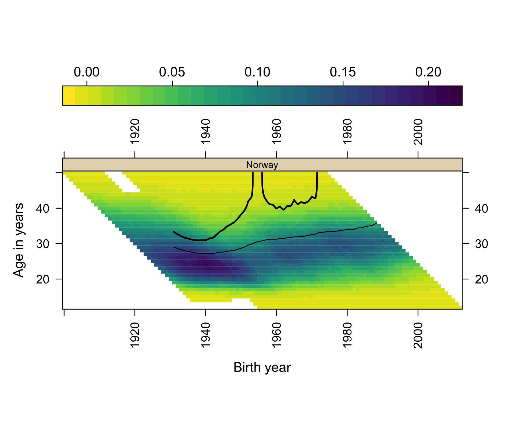
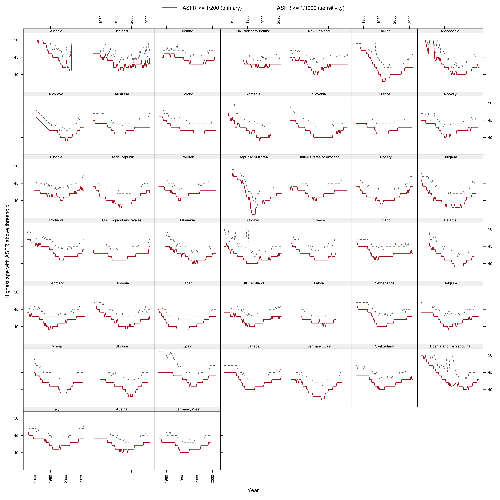
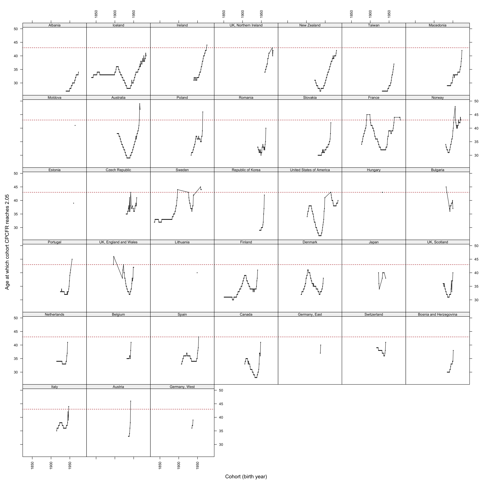
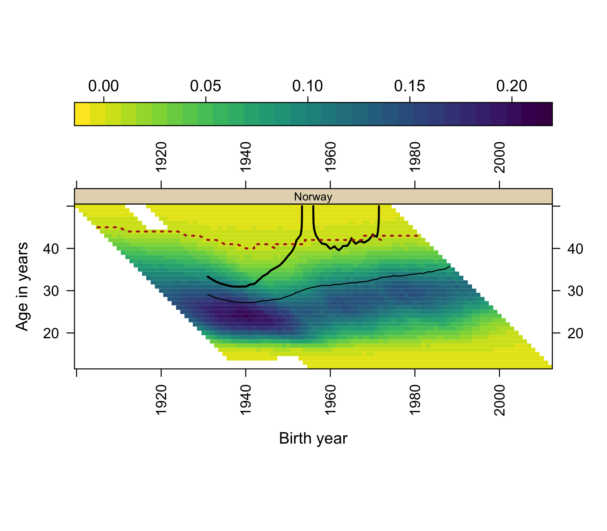
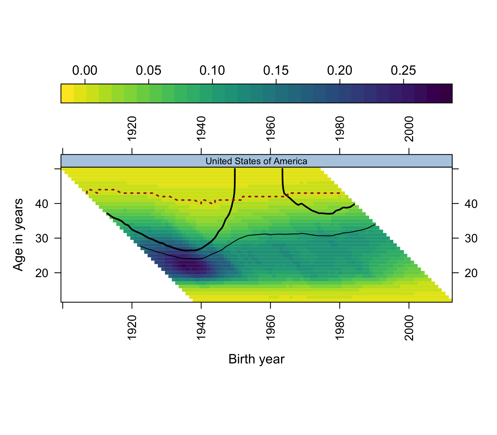

::: {.content-visible when-format="docx"}
> **FOR REVIEWERS (Word copy).** Please comment using Word's *Comments* and
> *Track Changes* features — do not edit silently. Return the file to
> <jon.will.minton@gmail.com>. Comments will be logged in the project's public
> feedback register (`manuscript_2026/review/FEEDBACK.md` on GitHub), actioned,
> and credited; substantive contributions meeting authorship criteria are
> recognized with co-authorship in later versions, with consent. This is the
> MERGED draft v0.1 (2026-07-14), not yet submitted anywhere.
:::

::: {.callout-note}
**Draft status and authorship.** This is a sole-authored working version
posted for open comment; Jon Minton is the only author and is solely
responsible for its content. It merges and supersedes two working papers of
11 July 2026 ("The exceptions collapse" and "The closing corridor"), which
remain in the project repository for provenance. The manuscript updates and
builds on @pattaro2020, whose co-authors Serena Pattaro and Laura
Vanderbloemen are acknowledged for the original work and for review comments
on the working papers, but are not authors of this version; contributions
meeting authorship criteria will be recognized with co-authorship in later
versions, with consent. The manuscript was drafted with AI assistance
(Claude, Anthropic) under the author's direction; the role of AI-assisted
workflow in this project is described in Section 7.3. The analysis is
reproducible from <https://github.com/JonMinton/Comparative_Fertility>;
analytic choices (thresholds, definitions) were fixed in the repository's
public workplan before the analysis ran on the updated data, with prototypes
on the pre-update data disclosed there.
:::

# Introduction

Fertility decline appears to have accelerated. Across rich and poor
countries alike, period fertility rates that had been drifting downward — or
in some cases recovering — turned more steeply downward at some point after
the late 2000s, and the near-simultaneity of the turn has attracted an
explanation to match: the arrival, from 2007–08 onward, of the smartphone
and the social-media ecology it carries. That thesis now has a substantial
popular following and a growing research literature, from broadband and
mobile-phone studies [@billari2019broadband; @guldi2017; @rotondi2020] to
recent working papers attributing much of the post-2007 decline in the
United States to digital-technology exposure [@hudson2026teen;
@moscoso2026wide; @myers2026iphone]. It also has competitors of long
standing — economic precarity after the 2008 crisis [@sobotka2011;
@kearney2022], housing, partnership formation, and the older diffusion
tradition in demography, which knew well before the smartphone that fertility
behaviour spreads through communication networks in ways that need not
respect economic gradients [@bongaartswatkins1996; @casterline2001].

This paper does not adjudicate that debate. Its claim is that the debate is
running ahead of its descriptive foundations, and mostly on the wrong
summary statistic. Total fertility rates collapse precisely the structure on
which the candidate explanations differ: *which ages* lost fertility, *which
cohorts* carry the loss, whether milestones are delayed or abandoned, and
whether the change arrived everywhere at once or diffused. What preserves
that structure is the fertility surface — age by cohort by rate — and a
practice of reading it that a 2020 paper by Pattaro, Vanderbloemen and
Minton developed for exactly this comparative purpose [@pattaro2020].

We proceed in three movements. First, an update with a resolution: the 2020
paper did something unusual for a descriptive visualization piece — it made
forecasts, in print, by extrapolating the geometry of its surfaces for its
two exceptional countries, Norway and the United States. A decade of new
data lets those forecasts resolve, and their resolution is instructive:
both were right in direction and wrong in the same way, understating
severity. Second, a diagnosis: what the visual extrapolations could not see
was the boundary they were extrapolating toward. We define and measure the
*effective ceiling* of the fertility lifecourse across the panel's 175
years, show it to be behavioural rather than biological, and derive the
corridor arithmetic that now governs any return to replacement. Third, a
bridge: we argue that the 2020 forecasts exemplify a general practice —
surface visualization as *informal model building* — and show how the same
practice, applied to the post-2008 acceleration, generates the
discriminating hypotheses that separate the smartphone thesis from its
competitors. Those hypotheses are not tested here: they are frozen in a
preregistered protocol for a global panel, registered before its outcome
data were downloaded, to which this paper is the descriptive companion.

# The 2020 baseline and its forecasts

Using data from the Human Fertility Database (HFD) and Human Fertility
Collection (HFC) ending in 2014–15, @pattaro2020 introduced composite
fertility lattice plots — Lexis surfaces combining level-plot shading of
age-specific fertility rates (ASFRs) with contour lines marking cumulative
pseudo-cohort fertility rate (CPCFR) milestones at 1.50 and 2.05
("replacement") children per woman — and reported a striking regularity
across 45 countries: once a country's cohorts fell below the replacement
milestone, they tended not to return to it. Two exceptions were named:
Norway, where cohorts born after the 1950s regained replacement, and the
United States, for cohorts born after the late 1960s.

{#fig-2020-published}

The 2020 paper did more than describe its two exceptions: reading the
trajectories of the replacement contours in its Figure 2 (reproduced here as
@fig-2020-published), it extrapolated them. The published discussion
reasoned that the contour "has been trending upwards for Norway but falling
for the United States," that cumulative fertility by age 43 is in practice
close to completed fertility, and concluded that "Norway looks likely to
lose replacement fertility levels over the next few years," whereas "we
might assume that replacement levels will be sustained for longer in the
United States" [@pattaro2020, pp. 699–700]. These are qualitative
forecasts, formed by visual reasoning about where each contour was heading
and how much childbearing remained available above it.

{#fig-2018-draft}

The forecasts were, in an earlier working version of the figure, drawn
explicitly (@fig-2018-draft). That version — publicly timestamped in the
project repository in September 2018, before publication — shows the
extrapolations as dotted "speculative extrapolation" lines: for Norway a
steep rise, replacement reached only at ever-later ages and hence soon not
at all; for the United States a near-flat continuation just above age 37.
The drawn lines did not survive review, but their verbal counterparts did,
and the repository provenance makes the informal forecast concrete and
datable. A decade of new data has since accumulated, covering the years in
which period fertility fell to record lows across the Nordic countries
[@comolli2021; @hellstrand2020], the United States [@kearney2022], and East
Asia [@yoo2018] — enough observation for the forecasts to resolve.

# Data and methods

## The 2026 rebuild

We reapply the combination rules of @pattaro2020 to the current HFD
[@hfd2026] and HFC [@hfc2026] releases: HFD is preferred over HFC for any
country-year; within the HFC, single-year periods with age in completed
years are retained under the collection preference STAT > ODE > RE;
small internal gaps (at most four years) are linearly interpolated and
flagged. The updated panel spans 1850–2025 (51 populations before the
published exclusions; the same 45-country panel after them). One correction
to the 2016 build is applied: HFD's France series (code FRATNP) was
previously dropped by an unmapped country code, so the published figures
showed France ending in 2008; the updated build restores France to 2023. A
back-revision audit against the 2016 dataset is included in the repository;
the largest differences (Ireland, Spain, Denmark) reflect HFD's own
revisions of historical exposures.

A consequence worth stating plainly: the 2020 findings remain reproducible
from the dataset frozen in the repository, but they are not exactly
replicable from fresh source downloads, because the source databases have
themselves been revised — an inherent property of living data
infrastructures, and part of the motivation for periodic updates of this
kind.

All surface figures use the published visual specification: viridis
(reversed) level-plot shading of ASFR on birth-year × age panels,
solid contours at CPCFR = 2.05 and 1.50, years 1950 onward, ages up to 50,
and countries ordered by CPCFR at 2007, the ranking year of the published
figures [@sarkar2008; @garnier2018].

## Ceiling, mass, and reachability

Three quantities, with definitions fixed ex ante in the repository's public
workplan before the analysis ran on the updated data:

- **Effective ceiling** of population $c$ in year $t$: the highest age at
  which ASFR ≥ 1/200 (primary threshold), with 1/1000 as a sensitivity
  threshold. The thresholds operationalize "ages at which childbearing is
  still a live behavioural possibility" rather than a biological limit.
- **Late-fertility mass**: cumulative ASFR at ages 40+ (and 35+) in a given
  country-year — the arithmetic maximum that childbearing at those ages
  could contribute to a cohort's total.
- **Reachability**: for each cohort observed from age 16 or earlier, the age
  at which CPCFR first reaches 2.05, classified as *crossed*; *never*
  (observed beyond age 44 without crossing); or *censored* (still
  unobserved at the ages that would decide it).

Per-country trajectories are the primary outputs throughout; pooled decade
medians are reported as context only.

# Results I: the forecasts resolve

@tbl-scoreboard states the resolutions first; the sections that follow show
them on the updated surfaces.

| Reading in @pattaro2020 | Outcome on data to 2023–25 |
|:---|:---|
| "Once countries have fallen below a replacement fertility level, they tend to not return to it." | Strengthened: 43 of 45 countries now have post-war cohorts observed beyond age 44 that never reached replacement. |
| Norway "looks likely to lose replacement fertility levels over the next few years." | Correct in direction, exceeded in severity: no cohort born after 1971 reaches replacement at any observed age; the contour escapes vertically rather than drifting. Period TFR 1.98 (2009) → 1.40 (2023). |
| "Replacement levels will be sustained for longer in the United States" (annotated "Replacement age 37"). | Correct so far, but eroding faster than drawn: crossings continue through the 1984 cohort, at ages 39–40 rather than near 37; cohorts beyond are censored and running lower at every age. |

: The 2020 extrapolations and their resolutions. {#tbl-scoreboard}

## Norway

{#fig-norway}

The updated Norway panel (@fig-norway) now shows a complete arc. The 2.05
contour climbs steeply — effectively vertically — for cohorts born around
1950; returns to the surface at around age 40 for cohorts born 1958–68, the
recovery that made Norway the 2020 paper's leading exception [@kravdal2016];
and then escapes vertically a second time for cohorts born after
approximately 1972. On current data no Norwegian cohort born after 1971
reaches replacement at any observed age. The 1.50 contour drifts steadily
upward, reaching roughly age 36 for cohorts born in the late 1980s before
censoring. Norway's period TFR fell from 1.98 in 2009 to 1.40 in 2023, a
record low [@hfd2026].

Set against the 2020 extrapolation, this is a resolution in the predicted
direction but of greater severity. The drawn version of the forecast
(@fig-2018-draft) had the replacement contour climbing over roughly fifteen
further cohorts; the verbal version anticipated loss "over the next few
years." What the updated surface shows instead is that the loss was already
complete at the data edge the 2020 authors were reading: the contour does
not climb — it terminates. The forecast erred only in imagining a gradual
exit where the exit was, in the event, immediate and total.

## United States

{#fig-usa}

The United States requires a more careful statement (@fig-usa). Its period
TFR fell from 2.12 (2007) to 1.59 (2024), a record low. In cohort terms,
however, the exception *persisted* longer than the period collapse suggests:
cohorts born 1982, 1983 and 1984 all crossed CPCFR = 2.05, at ages 39, 39
and 40 respectively, with completed cumulative fertility of 2.14, 2.13 and
2.09. The 1985 cohort stood at 2.04 by age 39 (data to 2024) and will
plausibly cross; trajectories for cohorts born after the mid-1980s run
progressively lower at every age but remain right-censored. The US exception
has thus not yet collapsed in cohort terms; it is fading from below, cohort
by cohort, exactly as the period-based literature on postponement would
predict [@sobotka2017; @kearney2022].

This too resolves the 2020 extrapolation as directionally right and too
gentle. Replacement *was* "sustained for longer in the United States" — by
some twenty further birth cohorts. But the drawn forecast continued the
contour near-flat from "replacement age 37" (@fig-2018-draft), and the
realized crossings occurred at 39–40: the contour rose by two to three
years of age in under two decades of cohorts, converging on the terminal
ages at which the Norwegian contour had already escaped. Sustained, that
is, not by stable timing but by pushing childbearing against the upper edge
of the reproductive lifecourse — a distinction invisible in period TFR and
legible only on the surface.

## The panel as a whole

{#fig-top15}

Across the full panel, 43 of 45 countries now have post-war cohorts observed
beyond age 44 that never reached replacement (@fig-top15). Only nine
countries have *any* cohort born in 1970 or later that crossed 2.05
(@tbl-lastcohort) — and the most recent crossing cohorts are: United States
1984, Iceland 1983, Northern Ireland 1981, France 1980, New Zealand 1980.
Norway and the United States were therefore never the *only* populations at
or above replacement: Iceland, France, New Zealand and Northern Ireland also
saw cohorts born around 1980 cross the milestone, as did several
south-eastern European populations for cohorts born into the mid-1970s
(Macedonia 1974, Albania 1973). What made Norway and the United States the
named exceptions of the 2020 paper was narrower: among the notably rich
populations of the panel, they were the two whose cohort fertility had
*recovered* to replacement after earlier decline. It is that recovery,
specifically, that the new data shows ending. South Korea, newly covered
here from 1960 (the 2020 panel's Korean series ended in 2007), last saw a
cohort reach replacement with those born in 1958; its period TFR in 2024 was
0.75 [@yoo2018].

| Country | Last cohort crossing 2.05 | Age at crossing |
|:---|---:|---:|
| United States | 1984 | 40 |
| Iceland | 1983 | 40 |
| UK, Northern Ireland | 1981 | 42 |
| France | 1980 | 43 |
| New Zealand | 1980 | 42 |
| Ireland | 1975 | 44 |
| Macedonia | 1974 | 42 |
| Albania | 1973 | 34 |
| Norway | 1971 | 43 |

: The nine countries with any cohort born in 1970 or later reaching CPCFR = 2.05, most recent first. Full 45-country table in the repository (`data/derived_2026/last_cohort_replacement.csv`). {#tbl-lastcohort}

Note the ages in @tbl-lastcohort's third column: with one exception
(Albania, whose crossing at 34 belongs to an earlier fertility regime),
every terminal crossing since 1970 occurred at ages 40–44. The regularity's
final exceptions did not end at random ages; they ended pressed against a
common boundary. That observation motivates the second half of the paper.

# Results II: the ceiling and the corridor

Both 2020 forecasts failed in the same direction: reality was more severe.
A shared failure mode suggests a shared missing term, and the terminal
crossing ages point to what it is — a boundary on late childbearing that
visual extrapolation treated as open space. The 2020 figure had, in fact,
annotated it without theorizing it: "Replacement age 43."

## The ceiling is behavioural and nearly fixed

{#fig-walls}

Defining the effective ceiling as the highest age with ASFR ≥ 1/200,
the pooled decade medians run: 45 (1950s), 44 (1960s), 42 (1970s), 41
(1980s and 1990s), 42 (2000s), 42 (2010s), 43 (2020s) (@fig-walls). Three
features matter. First, the nineteenth-century populations of the panel
show ceilings at 47–48: childbearing at those ages was an ordinary part of
high-parity regimes, so the modern ceiling is not biology. Second, the
descent to 41 by the 1980s tracks the spread of parity control: stopping
behaviour truncated high-parity childbearing from the top down. Third, the
recovery since the 1990s trough has been slow and remarkably uniform —
roughly one year of age per fifteen calendar years — despite three decades
of assisted reproduction, postponement, and policy variation. The ceiling
behaves like a structural feature, not a margin under active renegotiation.

## The mass behind the ceiling is small

Median cumulative fertility above age 40 fell from 0.117 children (1950s)
to 0.023 (1980s) and has recovered to 0.065 (2020s) — at its
twenty-first-century maximum, about 3 percent of a replacement target
(per-country trajectories in the repository; `late_mass_trends.png`). The
arithmetic is unforgiving: for a cohort entering its forties with
cumulative fertility below roughly 1.99, no historically observed amount of
40+ childbearing reaches 2.05. Late recuperation can and does finish
journeys that are nearly complete [@beaujouan2020]; it cannot substitute
for the years the corridor has consumed.

## Reachability: where the replacement contour meets the wall

{#fig-reach}

Plotting each cohort's age at crossing 2.05 (@fig-reach) shows the
regularity's kinematics: in country after country, crossing ages drift
upward toward the low-40s reference line before crossings cease altogether.
Combined with the rise in ages at first birth of five to six years since
the 1970s [@sobotka2017; @beaujouan2020] against a ceiling that recovered
two, the corridor within which replacement remains arithmetically reachable
now spans roughly thirteen years — approximately ages 30 to 43 — for a
cohort starting childbearing at today's median ages.

## The wall on the surface

{#fig-norwall}

{#fig-usawall}

Overlaying the ceiling on the composite surface makes the two
contour-termination modes visually distinct: contours that climb into the
ceiling and end there (*wall-terminated*) versus contours cut by the right
edge of the data (*censored*). For Norway (@fig-norwall), both escapes of
the replacement contour are wall-terminations, not censoring artifacts: the
2020 forecast's error is visible as the gap between open space assumed and
boundary present. For the United States (@fig-usawall), the right end of
the contour is censored — the honest statement is that the US verdict
remains open, with the contour three years' age from the ceiling and
closing. The South Korean panel, the panel's extreme case, is in the
repository.

A note on visual complexity: in grammar-of-graphics terms the ceiling adds
a fifth encoding to an already four-dimensional composite (x, y, shading,
contour weight) — though it is better understood as a third *reading* of
the single underlying ASFR field: its level (shading), its accumulation
(contours), and its effective boundary (the ceiling), each a computation
the eye cannot perform unaided. Because four encodings already approach the
limit of comfortable readability for many audiences [@pattaro2020], we
confine this densest form to the two featured panels above and use the
established four-encoding composite everywhere else.

# From reading surfaces to building models

## What the 2020 forecasts were

The 2020 extrapolations were not outputs of a formal model: they were acts
of *informal model building* — qualitative, falsifiable forecasts formed by
reading the geometry of a fertility surface, using visible structure (where
a contour is heading; how much childbearing remains available above it) as
the model. Both forecasts resolved in the predicted direction, and both
erred the same way, understating severity. That shared failure mode is
itself informative: what the visual extrapolations could not see was the
boundary they were extrapolating toward — the effective upper edge of the
fertility lifecourse, annotated in 2020 as "replacement age 43" without
being theorized, and measured in Section 5 of this paper. This is the
ordinary dialectic of model building — a model fails in a patterned way;
the pattern names the missing structure; the structure enters the next
model — carried out in the visual register.

## The same practice, applied to the acceleration

The practice generalizes, and the post-2008 acceleration is the natural
next application, because the candidate explanations differ precisely in
the surface geometry they imply. A *period shock* — the 2008 financial
crisis and its long shadow [@sobotka2011; @goldstein2009] — should appear
as a vertical front: fertility falling across all childbearing ages in the
same calendar years, with intensity graded by each country's economic
exposure. A *diffusion process* riding a new communication technology — the
smartphone thesis in its behaviourally explicit form [@hudson2026teen;
@moscoso2026wide; @myers2026iphone; @billari2019broadband] — should appear,
in its simplest young-first variant, as a *sloped* front: onset earliest at
the youngest, most-connected ages and arriving at older ages with a lag, in
country after country regardless of development level, as the older
diffusion literature would expect of behaviour spreading through
communication networks [@bongaartswatkins1996; @casterline2001;
@roserobixby1993]. A *cohort-carried* change — new cohorts bringing revised
intentions with them as they age through the childbearing years — should
travel along the 45-degree diagonal of the Lexis surface.

The updated panels are suggestive on inspection: post-2008 lightening of
the surface is visible at young ages in many countries, including several
where the crisis narrative fits poorly. But we decline to adjudicate by
eye, for exactly the reason Part I of this paper teaches: the 2020
forecasts show that unaided surface reading is powerful at generating
hypotheses and systematically fallible at extrapolating them. Two specific
mimics discipline any reading of the acceleration. Tempo mimicry:
postponement alone moves fertility out of young ages first, so a
young-first front can be produced by delay without any quantum change —
distinguishing them requires following cohort cumulative milestones, which
the CPCFR contours carry. Mean-reversion mimicry: several countries
entered 2008 at the top of a recuperation upswing [@goldstein2009;
@myrskyla2013], so a post-2008 "break" can be manufactured by reversion to
an older trend. Existing evidence on the digital thesis, moreover, is
largely teen-focused or single-country [@guldi2017; @kearney2015media;
@jaeger2020], and the most prominent null for ages 25+ rests on a
detrending that removes any effect common to all ages by construction
[@moscoso2026wide] — so the question of a *level* response across the full
age range remains open.

These considerations — hypotheses legible on the surface, mimics that
defeat the eye — are the motivation for the formal companion to this paper:
a preregistered universality test on a global panel (UN World Population
Prospects 2024, chosen to escape the rich-country selection of the
HFD/HFC), with break-date estimation, an age-gradient classification of
onset (period-shock versus young-first versus cohort-carried), tempo
guards built from CPCFR milestones, and equivalence tests against
development gradients. The protocol was frozen and registered publicly
(OSF registration [osf.io/j3tbq](https://osf.io/j3tbq), 12 July 2026)
*before* the outcome data were downloaded; this paper deliberately runs
none of its estimators on the present panel. The division of labour is the
paper's method made explicit: surfaces to see with, models to decide with.

## What COVID did and did not do

A reader of Part I may reasonably ask how the 2020 forecasts could resolve
cleanly across years that included a pandemic. The answer visible on the
surfaces is that COVID-19 arrived as texture, not trend: dips in 2020–21
births and partial rebounds in several countries, superimposed on an
acceleration that was already a decade old by the pandemic's onset. The
corridor quantities in Section 5 move smoothly through the pandemic years.
Whether the pandemic nonetheless left a persistent mark — or shared causes
with the broader decline — is exactly the kind of question the eye cannot
settle; the preregistered protocol excludes 2020–24 from its estimation
windows and treats pandemic-era displays as exploratory, and we follow the
same discipline here.

# Discussion

## Stylized facts any explanation must match

The corridor framing contributes discipline, not adjudication, to the
acceleration debate. Any candidate explanation — economic precarity,
housing, partnering, smartphone-era social change — must match the same
fingerprint: which ages lost fertility, which cohorts carry the loss,
whether milestones are delayed (tempo) or abandoned (quantum), why
near-identical exposures produce heterogeneous national responses
[@comolli2021; @hellstrand2020], and — the constraint this paper adds — why
the final departures from replacement, in country after country, occurred
pressed against a nearly fixed ceiling in the low forties. The ceiling also
converts postponement arithmetic into quantum consequences even under
unchanged intentions: trajectories that start later run into an upper
boundary that has moved two years while starting ages moved six.
Replacement has become a corridor roughly thirteen years wide, and the
corridor is closing from below.

## Limitations

Assisted reproduction is shifting the ceiling slowly and unevenly, and a
technology-driven acceleration of that shift would loosen the corridor
arithmetic prospectively. Ceiling estimates at fixed thresholds are
sensitive to small-population noise (hence per-country trajectories as the
primary output and the 1/1000 sensitivity threshold). CPCFRs built from
Lexis squares are pseudo-cohort quantities, not true cohort rates
[@pattaro2020]. The cohorts most relevant to the acceleration debate remain
right-censored — the US verdict in particular is open. Single-year
all-parity ASFRs cannot separate parity-specific dynamics; the natural
extension uses the by-birth-order collections already assembled in the
repository [@zeman2018]. And the panel itself is rich-country selected,
which is precisely why the preregistered companion moves to a global panel
for the universality question.

## A note on workflow: agentic updating and the staleness problem

Descriptive papers built on living databases decay. The sources revise
their histories (Section 3.1's back-revision audit), extend their coverage,
and accumulate exactly the years that would test a published reading — and
the papers, being labour-intensive to rebuild, are rarely rebuilt. The
present update is a documented experiment in closing that gap: the 2016
pipeline was revived, re-validated against archived data, extended to the
2026 releases, and carried through new analysis, manuscript drafting, and a
preregistered follow-on protocol within days of the decision to revisit the
2020 paper, by agentic AI assistance (Claude, Anthropic) working under the
author's direction in the project's public repository. The comprehensiveness
mattered as much as the speed: a 45-country revalidation, a back-revision
audit, a France code-mapping bug caught and fixed, and an ex-ante-registered
analysis plan are each the kind of due diligence that a human-only side
project realistically defers or drops. The epistemic safeguards are public
and inspectable rather than testimonial: a decision log fixing analytic
choices before they ran, a feedback register recording reviewer comments
and their disposition, versioned manuscripts, and a preregistration for the
confirmatory step. We record this not as a disclosure liability but as a
finding about method: periodic, audited, AI-assisted rebuilds are a
practical answer to staleness in descriptive demography, and the update
cadence of a paper can become a property of its repository rather than of
its authors' spare time.

# Conclusions

The 2020 regularity — below replacement, no return — has been strengthened
rather than weakened by a decade of data, at the cost of both its named
exceptions. Norway's recovery is now bracketed on both sides by vertical
contour escapes; the United States' recovery survives through cohorts born
in the early 1980s and is fading in the censored region beyond. The
forecasts the 2020 paper ventured for both countries resolved in the
predicted direction and erred identically in magnitude, and the error had a
name: an effective ceiling of the fertility lifecourse, behavioural in
origin, nearly fixed on the timescale of the postponement transition, and
now measured across 175 years of surfaces. Between a floor that has risen
six years and a ceiling that has recovered two, replacement fertility has
become a thirteen-year corridor — and the practice of reading surfaces that
found the corridor is also, we have argued, the right generator of
hypotheses about why the corridor's traffic thinned so suddenly after 2008.
Those hypotheses are registered; the global test is next.

::: {.callout-note}
**Reproducibility and contributions.** Code, combined data, validation
reports, figure pipelines, the feedback register, and this manuscript's
source are public at
<https://github.com/JonMinton/Comparative_Fertility>. The preregistered
companion protocol is at <https://osf.io/j3tbq>. Analytical pipeline and
drafting were assisted by Claude (Anthropic) under the author's direction;
all analyses are re-runnable end-to-end and all numbers in this draft are
machine-generated from the pipeline. The author thanks Serena Pattaro and
Laura Vanderbloemen, co-authors of the 2020 paper, for the original work
this paper updates and for review comments on the working papers.
<!-- TODO: CRediT roles; funding statement; formal acknowledgements pass
once contributor conversations conclude -->
:::

# References
