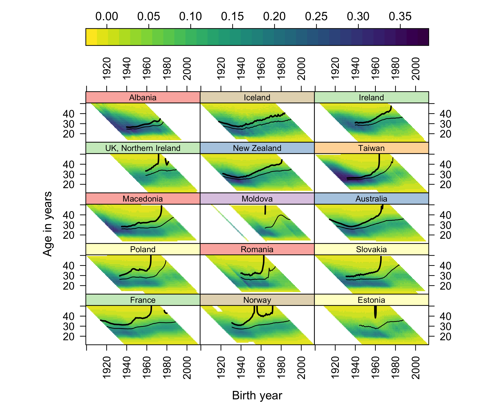

::: {.callout-note}
**Draft status.** This is an early working version posted for open comment; the
analysis is reproducible from <https://github.com/JonMinton/Comparative_Fertility>
(see `UPDATE_WORKPLAN.md` there for the decision log). Figures and numbers are
machine-generated from the pipeline described in Methods. Comments welcome ---
and contributions meeting authorship criteria will be recognized with
co-authorship in later versions. This update builds on @pattaro2020, co-authored
with Serena Pattaro and Laura Vanderbloemen, who are warmly invited to rejoin.
:::

# Background

Using data from the Human Fertility Database (HFD) and Human Fertility
Collection (HFC) ending in 2014--15, @pattaro2020 introduced composite lattice
plots --- Lexis surfaces combining level-plot shading of age-specific fertility
rates (ASFRs) with contour lines marking cumulative pseudo-cohort fertility
rate (CPCFR) milestones --- and reported a striking regularity across 45
countries: once a country's cohorts fell below the replacement milestone
(CPCFR $<$ 2.05), they tended not to return to it. Two exceptions were named:
Norway, where cohorts born after the 1950s regained replacement, and the United
States, for cohorts born after the late 1960s.

A decade of new data has since accumulated, covering the years in which
period fertility fell to record lows across the Nordic countries
[@comolli2021; @hellstrand2020], the United States [@kearney2022], and East
Asia [@yoo2018].

# Objective

To update the 45-country composite lattice plots with HFD and HFC data
extending to 2023--25, and to re-examine the status of the two named
exceptions.

# Methods

We reapply the combination rules of @pattaro2020 to the current HFD
[@hfd2026] and HFC [@hfc2026] releases: HFD is preferred over HFC for any
country-year; within the HFC, single-year periods with age in completed years
are retained under the collection preference STAT $>$ ODE $>$ RE; small
internal gaps (at most four years) are linearly interpolated and flagged. The
updated panel spans 1850--2025 (51 populations before the published
exclusions; the same 45-country panel after them). One correction to the 2016
build is applied: HFD's France series (code FRATNP) was previously dropped by
an unmapped country code, so the published figures showed France ending in
2008; the updated build restores France to 2023. A back-revision audit against
the 2016 dataset is included in the repository; the largest differences
(Ireland, Spain, Denmark) reflect HFD's own revisions of historical exposures.
A consequence worth stating plainly: the 2020 findings remain reproducible from
the dataset frozen in the repository, but they are not exactly replicable from
fresh source downloads, because the source databases have themselves been
revised --- an inherent property of living data infrastructures, and part of
the motivation for periodic updates of this kind.

All figures use the published visual specification: viridis (reversed)
level-plot shading of ASFR on birth-year $\times$ age panels, solid contours at
CPCFR = 2.05 and 1.50, years 1950 onward, ages up to 50, and countries ordered
by CPCFR at 2007, the ranking year of the published figures
[@sarkar2008; @garnier2018].

# Results

## Norway

{#fig-norway}

The updated Norway panel (@fig-norway) now shows a complete arc. The 2.05
contour climbs steeply --- effectively vertically --- for cohorts born around
1950; returns to the surface at around age 40 for cohorts born 1958--68, the
recovery that made Norway the 2020 paper's leading exception [@kravdal2016];
and then escapes vertically a second time for cohorts born after
approximately 1972. On current data no Norwegian cohort born after 1971
reaches replacement at any observed age. The 1.50 contour drifts steadily
upward, reaching roughly age 36 for cohorts born in the late 1980s before
censoring. Norway's period TFR fell from 1.98 in 2009 to 1.40 in 2023, a
record low [@hfd2026].

## United States

The United States requires a more careful statement. Its period TFR fell from
2.12 (2007) to 1.59 (2024), a record low. In cohort terms, however, the
exception *persisted* longer than the period collapse suggests: cohorts born
1982, 1983 and 1984 all crossed CPCFR = 2.05, at ages 39, 39 and 40
respectively, with completed cumulative fertility of 2.14, 2.13 and 2.09. The
1985 cohort stood at 2.04 by age 39 (data to 2024) and will plausibly cross;
trajectories for cohorts born after the mid-1980s run progressively lower at
every age but remain right-censored. The US exception has thus not yet
collapsed in cohort terms; it is fading from below, cohort by cohort, exactly
as the period-based literature on postponement would predict
[@sobotka2017; @kearney2022].

## The panel as a whole

{#fig-top15}

Across the full panel, 43 of 45 countries now have post-war cohorts observed
beyond age 44 that never reached replacement. Only nine countries have *any*
cohort born in 1970 or later that crossed 2.05 --- and the most recent
crossing cohorts are: United States 1984, Iceland 1983, Northern Ireland 1981,
France 1980, New Zealand 1980. South Korea, newly covered here from 1960
(the 2020 panel's Korean series ended in 2007), last saw a cohort reach
replacement with those born in 1958; its period TFR in 2024 was 0.75
[@yoo2018].

# Conclusions

The 2020 regularity --- below replacement, no return --- has been strengthened
rather than weakened by a decade of data, at the cost of both its named
exceptions. Norway's recovery is now bracketed on both sides by vertical
contour escapes; the United States' recovery survives through cohorts born in
the early 1980s and is fading in the censored region beyond. The geometry of
these escapes --- contours climbing through ages at which little fertility
remains --- points to a structural constraint on any return to replacement,
which we develop in a companion paper on the effective upper boundary of the
fertility lifecourse.

::: {.callout-note}
**Reproducibility and contributions.** Code, combined data, validation
reports, and this manuscript's source are public at
<https://github.com/JonMinton/Comparative_Fertility>. Analytical pipeline and
drafting were assisted by Claude (Anthropic); all analyses are re-runnable
end-to-end and all numbers in this draft are machine-generated from the
pipeline. <!-- TODO: acknowledgements; funding; co-author contributions -->
:::

# References
