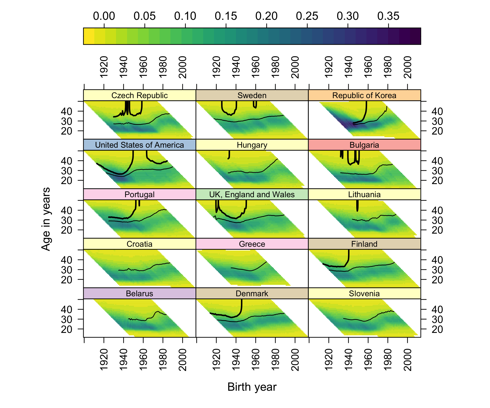
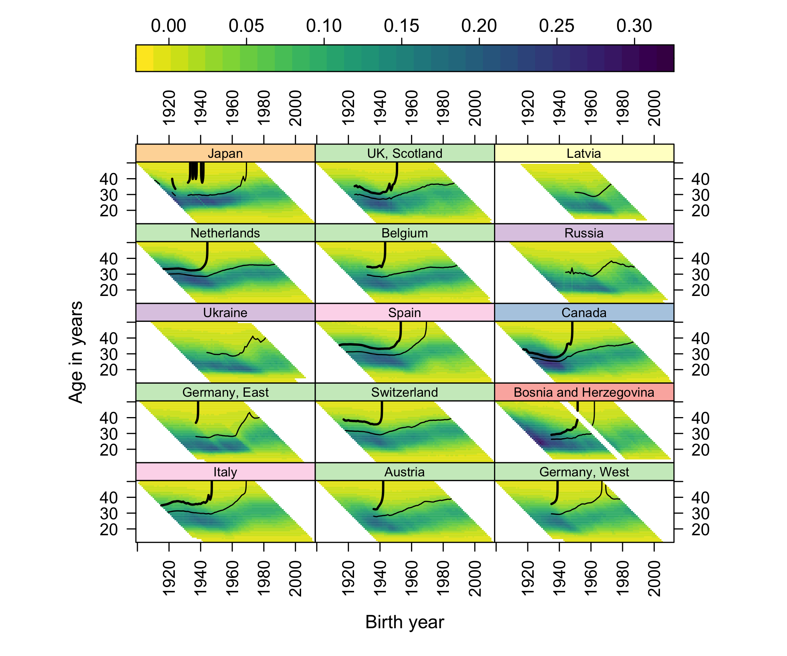
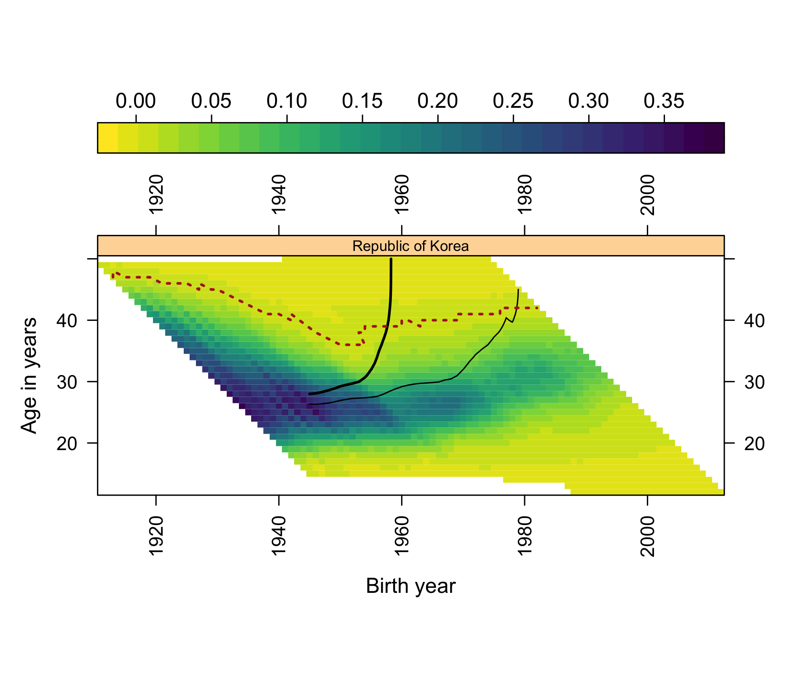
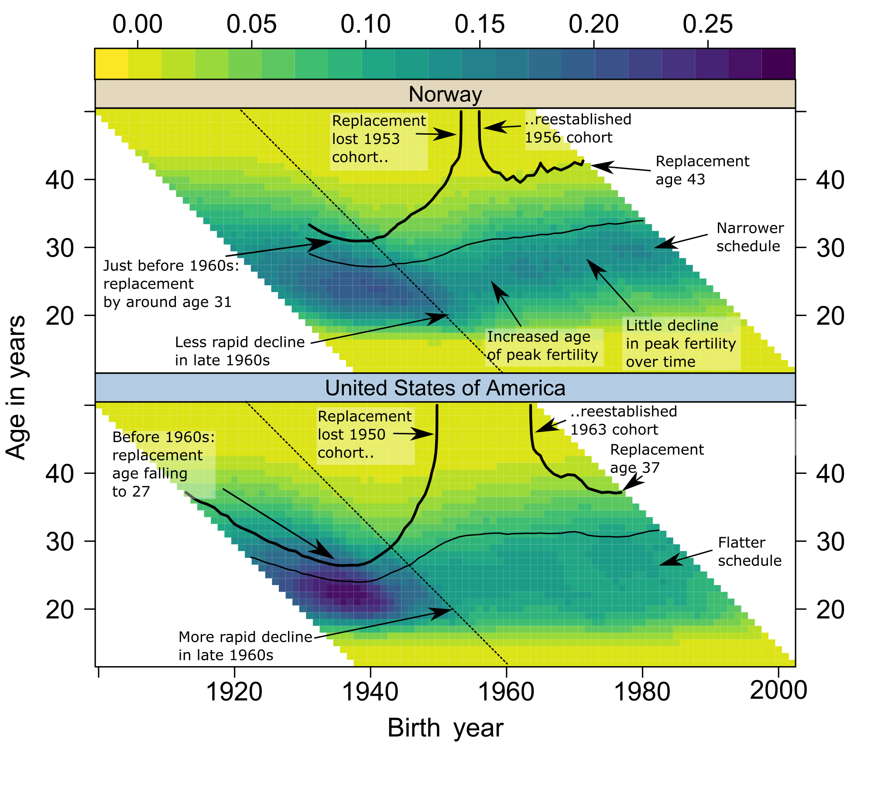
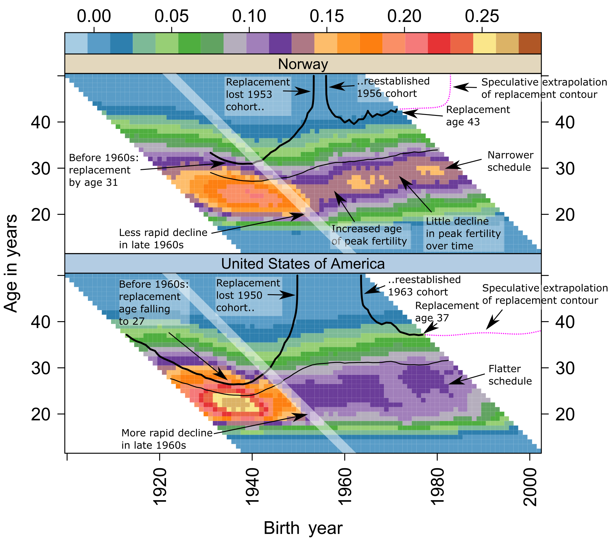
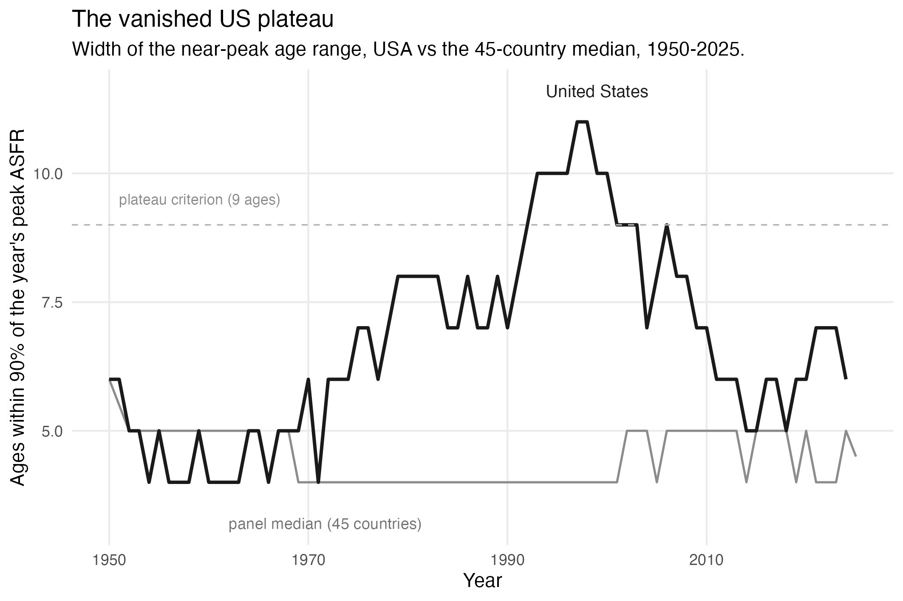

::: {.callout-note}
All materials here are generated from the public project repository
(<https://github.com/JonMinton/comparative_fertility>); each section names
its generating script. The 2020-vintage state of the repository is
preserved at tag `demres-2020`. Terms: AAPF = age and amount of peak
fertility; ANR = age of no return; CPCFR = cumulative pseudo-cohort
fertility rate; definitions in the main paper, Section 3.2.
:::

# S1. The full 45-country composite panel

The main paper features Norway and the United States; the full panel,
updated to 2023-25 and ordered by CPCFR at 2007 as in @pattaro2020, is
shown here in three blocks of fifteen. An interactive version, with
country selection and animation over time, is maintained at
<https://datascapes.shinyapps.io/cumulative_fertility_app/>.
Script: `scripts/figures_2026.R`.

{#fig-s1a}

{#fig-s1b}

{#fig-s1c}

# S2. Featured ANR overlays: censored versus wall-terminated

The main paper's featured Norway panel shows both escapes of
the replacement contour terminating at the ANR. The United States panel
below shows the contrast that matters for the still-open US verdict: its
contour's right end is cut by the data edge - censored, not
wall-terminated. South Korea, the panel's extreme case, is included for
comparison. Script: `scripts/wall_2026.R`.

{#fig-s2a}

{#fig-s2b}

# S3. Per-country squeeze trajectories: ordering and derived data

The full 45-country panel of AAPF and ANR trajectories appears in the
main paper (Section 6.2), ordered by latest period TFR, highest first -
from Moldova (1.66) to the Republic of Korea (0.75). This section
records what stands behind that ordering. TFRs are computed as the sum
of single-year ASFRs; country-years with fewer than 30 observed ages
are skipped, so a partial final year cannot understate a country's TFR.

Latest observed years are not common across the panel: nine series end
in 2021 or earlier (Albania 2008, Greece and Latvia 2009, Romania 2013,
both Germanys 2017, Belarus 2018, Ukraine and Bulgaria 2021), and since
TFRs have declined almost everywhere since, ordering raw last-observed
values would rank stale series systematically too high. The last year
common to all 45 series is 2008 - before the acceleration this paper
concerns - so a common-year ordering is no remedy. Instead, series
ending before 2022 are *vintage-adjusted* from the panel itself: the
last observed TFR is multiplied by the panel-median ratio of latest to
same-year TFR among the 36 series observed in 2022-25. The correction
is thus the panel-wide decline the paper documents, applied at the
median; it uses no external data. It moves Greece from 12th to 32nd
(1.52 observed in 2009, 1.22 adjusted) and both Germanys out of the top
ten to mid-table (~1.36-1.40) - in each case close to externally
reported recent values. Ukraine's adjusted value (1.03) is still likely
optimistic, since a panel-median correction cannot reflect the war.
Adjusted panels carry both values in their strip labels (year: observed
→ adjusted); the ordering is a presentational choice only and no
analytical quantity depends on it.
Ordering table (observed and adjusted values, factors, ranks):
`data/derived_2026/latest_tfr_by_country.csv`.
Trajectory data: `data/derived_2026/squeeze_by_country_year.csv`.
Script: `scripts/squeeze_2026.R`.

# S4. ANR trajectories, sensitivity, and the full last-cohort table

Per-country ANR trajectories at both thresholds are shown below: the
1/1000 boundary sits roughly two years above the primary 1/200 boundary
and moves in parallel, so the narrative in the main paper is not sensitive
to the choice. Late-fertility mass trajectories (cumulative ASFR at ages
40+ and 35+) are in the repository (`late_mass_trends.png`). The full
45-country version of the main paper's last-cohort table is at
`data/derived_2026/last_cohort_replacement.csv`.
Script: `scripts/wall_2026.R`.

{#fig-s4}

# S5. From reading surfaces to testing causes: candidate geometries and their mimics

This section sets out the reasoning, summarised in the main paper's
Discussion, that connects surface reading to the preregistered protocol
([osf.io/j3tbq](https://osf.io/j3tbq)).

The candidate explanations for the post-2008 acceleration differ precisely
in the surface geometry they imply. A *period shock* - the 2008 financial
crisis and its long shadow [@sobotka2011; @goldstein2009] - should appear
as a vertical front: fertility falling across all childbearing ages in the
same calendar years, with intensity graded by each country's economic
exposure. A *diffusion process* riding a new communication technology -
the smartphone thesis in its behaviourally explicit form [@hudson2026teen;
@moscoso2026wide; @myers2026iphone; @billari2019broadband] - should
appear, in its simplest young-first variant, as a *sloped* front: onset
earliest at the youngest, most-connected ages and arriving at older ages
with a lag, in country after country regardless of development level, as
the older diffusion literature would expect of behaviour spreading through
communication networks [@bongaartswatkins1996; @casterline2001;
@roserobixby1993]. A *cohort-carried* change - new cohorts bringing
revised intentions with them as they age through the childbearing years -
should travel along the 45-degree diagonal of the Lexis surface.

The updated panels are suggestive on inspection: post-2008 lightening of
the surface is visible at young ages in many countries, including several
where the crisis narrative fits poorly. But adjudication by eye fails,
for exactly the reason the main paper's forecast check teaches: unaided
surface reading is powerful at generating hypotheses and systematically
fallible at extrapolating them. Two specific mimics discipline any
reading of the acceleration. *Tempo mimicry*: postponement alone moves
fertility out of young ages first, so a young-first front can be produced
by delay without any quantum change - distinguishing them requires
following cohort cumulative milestones, which the CPCFR contours carry.
*Mean-reversion mimicry*: several countries entered 2008 at the top of a
recuperation upswing [@goldstein2009; @myrskyla2013], so a post-2008
"break" can be manufactured by reversion to an older trend. Existing
evidence on the digital thesis, moreover, is largely teen-focused or
single-country [@guldi2017; @kearney2015media; @jaeger2020], and the most
prominent null for ages 25+ rests on a detrending that removes any effect
common to all ages by construction [@moscoso2026wide] - so the question
of a *level* response across the full age range remains open.

These considerations motivate the preregistered universality test: a
global panel (UN World Population Prospects 2024, escaping the
rich-country selection of the HFD/HFC), break-date estimation, an
age-gradient classification of onset (period-shock versus young-first
versus cohort-carried), tempo guards built from CPCFR milestones, and
equivalence tests against development gradients. The protocol was frozen
and registered publicly on 12 July 2026, before its outcome data were
downloaded; the main paper deliberately runs none of its estimators.

# S6. COVID-19 on the surfaces

COVID-19 arrived on these surfaces as texture, not trend: dips in 2020-21
births and partial rebounds in several countries, superimposed on an
acceleration that was already a decade old at the pandemic's onset. The
runway quantities (AAPF, ANR, late mass, reachability) move smoothly
through the pandemic years in the per-country trajectories of the main
paper's 45-country squeeze figure and of S4.
Whether the pandemic left a persistent mark - or shared causes with the
broader decline - is exactly the kind of question the eye cannot settle;
the preregistered protocol excludes 2020-24 from its estimation windows
and treats pandemic-era displays as exploratory.

# S7. Provenance of the 2020 extrapolations

The main paper's forecast-check figure redraws the 2020-era
extrapolations onto re-rendered surfaces. The two source artifacts are
reproduced here.

The published Figure 2 of @pattaro2020 carried pedagogic annotations -
including the terminal contour readings "Replacement age 43" (Norway) and
"Replacement age 37" (United States) - but no drawn extrapolation lines;
the forecasts appear in the published text: the contour "has been trending
upwards for Norway but falling for the United States"; "Norway looks
likely to lose replacement fertility levels over the next few years";
"we might assume that replacement levels will be sustained for longer in
the United States" [@pattaro2020, pp. 699-700].

{#fig-s7a}

The extrapolations were drawn explicitly in a pre-publication working
version of the figure, publicly timestamped in the project repository in
September 2018, as dotted lines labelled "speculative extrapolation of
replacement contour": for Norway holding near age 43 for a further decade
of cohorts before turning vertical; for the United States continuing
nearly flat, near age 37-38, to the panel's edge. The drawn lines were dropped in
revision; the published text retained their verbal equivalents. The
working figure uses a draft-era colour palette that differs from the
published specification - one reason the main paper re-renders the
2020-vintage data (repository tag `demres-2020`,
`data/data_combined_and_standardised.csv`) in the current specification
rather than reproducing this figure in the comparison.

{#fig-s7b}

The magenta lines in the main paper's forecast check are digitized
programmatically from @fig-s7b by pixel extraction with tick-mark
calibration (`scripts/extract_2018_extrapolation.py`, with a QC overlay
in the repository); the coordinates are at
`data/derived_2026/extrapolation_2018_digitized.csv`.

# S8. The vanished US plateau

The United States was historically unusual for a flat-peaked - potentially
bimodal, subgroup-mixture - ASFR age profile, which is why the AAPF's
tie-to-youngest rule matters there and why the US is not used as the
terrain example in the main paper. Operationalising plateau width as the
number of single-year ages whose ASFR is within 90% of that year's
maximum, and calling a country-year a plateau year at width 9 or more:
the United States had thirteen plateau years, 1992-2006 - by far the
longest run in the panel (the next longest is Albania's six years in the
1950s-60s; only five countries have any). The plateau collapsed from the
left after the late 2000s with the teen and early-twenties fertility
decline, and by the 2020s the US profile is a conventional late single
peak (median width 6, matching its pre-1990 value). Total-schedule
analysis cannot distinguish subgroup convergence from early-subgroup
collapse; birth-order data would [@zeman2018], and the by-birth-order
collections already assembled in the repository are the natural extension.
Derived data: `data/derived_2026/plateau_width_by_country_year.csv`.
Script: `scripts/us_plateau_2026.R`.

{#fig-s8}

# References
