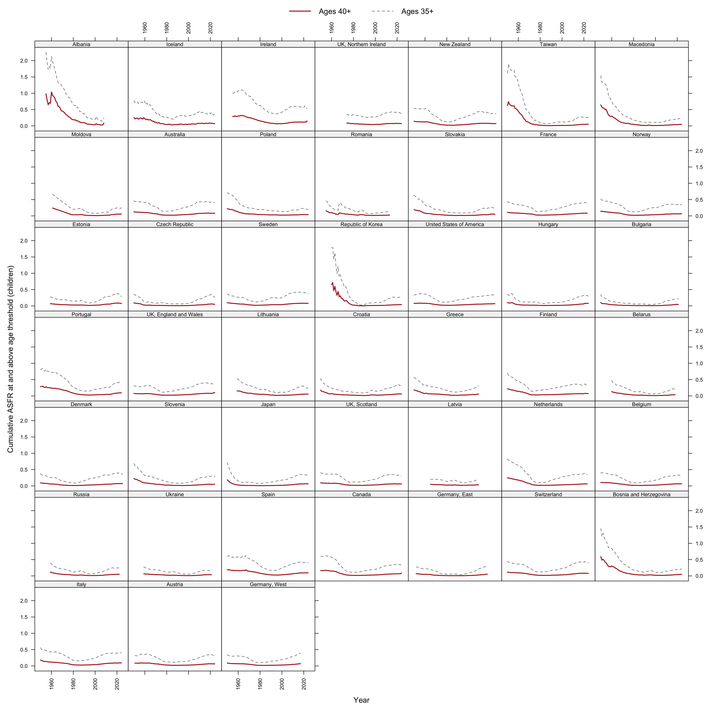

::: {.callout-note}
**Draft status.** Early working version posted for open comment. Reproducible
from <https://github.com/JonMinton/Comparative_Fertility>; analytic choices
(thresholds, definitions) were fixed in the repository's workplan before this
analysis ran on the updated data, with prototypes on the pre-update data
disclosed there.
:::

# Introduction

Two quantities jointly determine whether a cohort can reach replacement
fertility: when childbearing starts, and when it must end. The first has moved
enormously --- mean ages at first birth have risen five to six years since the
1970s across the low-fertility world [@sobotka2017; @beaujouan2020]. This
paper is about the second: the *effective ceiling* of the fertility
lifecourse, its history, and its consequence --- a corridor between a rising
floor and a nearly fixed ceiling within which replacement must now be
achieved.

We make three claims. First, the ceiling is behavioural, not biological: in
the nineteenth-century populations of our panel it sat at ages 47--48, was
pulled down to 41 by the 1980s as parity control truncated high-parity
childbearing, and has since crept back only to about 43. Second, the fertility
mass above age 40 is small enough (0.02--0.07 children) that no plausible
late-fertility recuperation can substitute for earlier childbearing
[@beaujouan2020]. Third, the interaction of these facts with cumulative
cohort fertility is directly visible on composite lattice plots
[@pattaro2020]: the replacement contour *goes vertical* where it meets the
ceiling, and the distinction between contours that hit the wall and contours
that are merely right-censored is itself informative.

<!-- TODO: expand literature positioning: tempo/quantum [@sobotka2017],
recuperation debates, latest-late fertility [@beaujouan2020], cohort forecasts
[@myrskyla2013]. -->

# Data and methods

Data: the updated 45-country HFD/HFC panel described in the companion
descriptive finding (combination rules of @pattaro2020 applied to the 2026
releases [@hfd2026; @hfc2026]; 1850--2025).

Definitions, fixed ex ante in the public workplan:

- **Effective ceiling** of population $c$ in year $t$: the highest age at
  which ASFR $\geq$ 1/200 (primary threshold), with 1/1000 as sensitivity.
- **Late-fertility mass**: cumulative ASFR at ages 40+ (and 35+) in a given
  country-year.
- **Reachability**: for each cohort observed from age 16 or earlier, the age
  at which CPCFR first reaches 2.05, classified as *crossed*; *never* (observed
  beyond age 44 without crossing); or *censored*.

# Results

## The ceiling is behavioural and nearly fixed

{#fig-walls}

Pooled decade medians of the primary ceiling: 45 (1950s), 44 (1960s), 42
(1970s), 41 (1980s and 1990s), 42 (2000s), 42 (2010s), 43 (2020s). The
recovery since the 1990s trough amounts to roughly one year of age per fifteen
calendar years (@fig-walls). <!-- TODO: brief per-country reading; note
countries where the ceiling is rising faster (e.g. Japan, Spain?) — read off
data/derived_2026/wall_by_country_year.csv -->

## The mass behind the ceiling is small

{#fig-mass}

Median cumulative fertility above age 40 fell from 0.117 (1950s) to 0.023
(1980s) and has recovered to 0.065 (2020s) (@fig-mass) --- at its
twenty-first-century maximum, about 3 percent of a replacement target. The
40+ segment cannot arithmetically rescue replacement for cohorts entering
their forties below roughly 1.99.

## Reachability: where the replacement contour meets the wall

{#fig-reach}

Forty-three of 45 countries have post-war cohorts observed beyond age 44 that
never reached 2.05; only nine have any cohort born after 1970 that crossed.
Crossing ages drift upward toward the ceiling before crossings cease
(@fig-reach). <!-- TODO: integrate last-cohort table
(data/derived_2026/last_cohort_replacement.csv); split the 'never' category by
era — pre-transition historical cohorts (France 1892, Sweden 1898) versus
modern ones — before drawing conclusions from first_never_cohort. -->

## The wall on the surface

{#fig-norwall}

Overlaying the ceiling on the composite surface (@fig-norwall; US and South
Korean panels in the repository) makes the two contour-termination modes
visually distinct: contours that climb into the ceiling and end there
(wall-terminated) versus contours cut by the right edge of the data
(censored). For Norway, both escapes of the replacement contour are
wall-terminations, not censoring artifacts.

# Discussion

<!-- TODO: full drafting. Key points fixed by the workplan's framing rule
("stylized facts any explanation must match — light, not heat"): -->

The corridor framing contributes discipline, not adjudication, to the current
debate on accelerating fertility decline. Any candidate explanation ---
economic precarity [@sobotka2011; @kearney2022], housing, partnering,
smartphone-era social change --- must match the same fingerprint: *which ages*
lost fertility, *which cohorts* carry the loss, whether milestones are delayed
(tempo) or abandoned (quantum), and why near-identical exposures produce
heterogeneous national responses [@comolli2021; @hellstrand2020]. The
composite surfaces render that fingerprint directly; they cannot, and we do
not, pick among co-timed period candidates. What the ceiling adds is
arithmetic: postponement is not neutral even under unchanged intentions,
because trajectories that start later run into an upper boundary that has
moved two years while starting ages moved six. Replacement has become a
corridor roughly thirteen years wide.

Limitations: assisted reproduction is shifting the ceiling slowly and
unevenly; ceiling estimates at thresholds are sensitive to small-population
noise (hence the per-country trajectories as primary output); the cohorts most
relevant to the current debate remain right-censored; and single-year ASFR
data cannot separate parity-specific dynamics --- the natural extension, using
the by-birth-order collections already assembled in the repository
[@zeman2018].

# References
